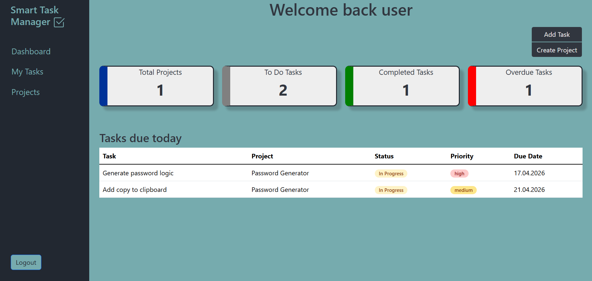
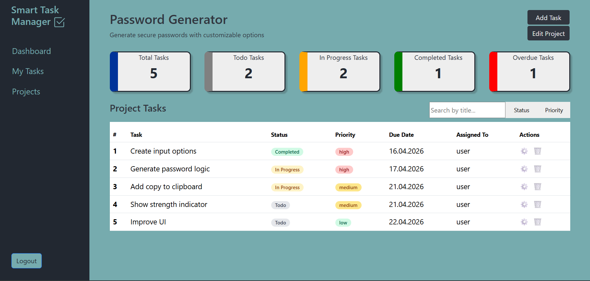
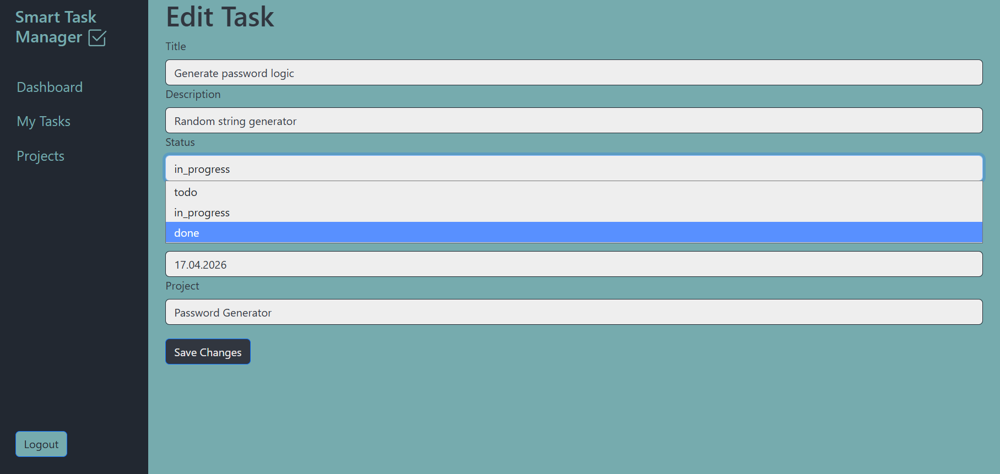

# Smart Task Manager 
A full-stack web application for managing projects and tasks with filtering, status tracking, and user authentication.

## Screenshots

### Dashboard


### Project View


### Edit Task Form


## Features

- User authentication (login & registration)
- Create and edit projects
- Create, edit and delete tasks
- Task filtering (search, status, priority)
- Status & priority badges
- Dynamic task summary (completed, overdue, etc.)
- Empty states for better UX

## Tech Stack

- Python (Flask)
- SQLAlchemy
- Jinja2
- JavaScript
- HTML / CSS
- Bootstrap

## Installation

1. Clone the repository
```bash
git clone https://github.com/kathleen547/SmartTaskManager.git
cd SmartTaskManager
```
2. Create virtual environment
```bash
python -m venv venv
venv\Scripts\activate  # Windows
```
3. Install dependencies
```bash
pip install -r requirements.txt
```
4. Initialize the database:
```bash
python create_db.py 
```
5. Run the application:
```bash
python run.py
```
## Future Improvements

- Pagination for task lists
- Role-based access (admin/user)
- REST API version of the app

## What I Learned

- Building full CRUD functionality with Flask
- Working with relational data using SQLAlchemy
- Implementing dynamic filtering with JavaScript
- Improving UX with empty states and UI feedback

